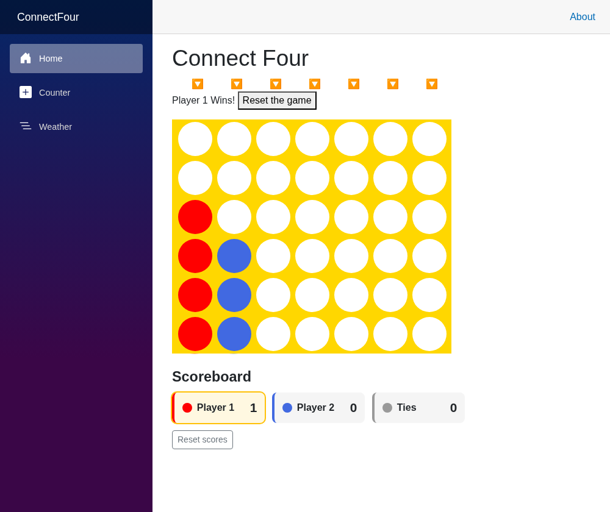

# Connect Four (Blazor)

A Connect Four game built with ASP.NET Core Blazor (Interactive Server) on .NET 10,
for CSE 325 — following the Microsoft Learn
[*Build a Connect Four game with Blazor*](https://learn.microsoft.com/training/modules/dotnet-connect-four/) module.



## Run it

```bash
dotnet run
```

Then open the `http://localhost:<port>` URL from the terminal. Click the 🔽 buttons
to drop pieces; players alternate red (Player 1) and blue (Player 2). Get four in a
row — horizontally, vertically, or diagonally — to win.

## Custom feature: win scoreboard

Beyond the tutorial, this version adds a **scoreboard** that keeps a running tally of
wins for Player 1, Player 2, and ties **across games**:

- Increments once when a game finishes.
- Persists through **Reset the game** (board clears, scores stay) so you can track
  wins over multiple rounds; the leader is highlighted.
- A separate **Reset scores** button clears the tally.

Implemented in [`Components/Board.razor`](./Components/Board.razor) and
[`Components/Board.razor.css`](./Components/Board.razor.css).
